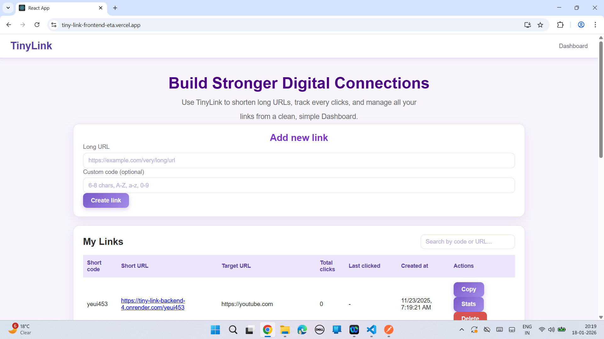
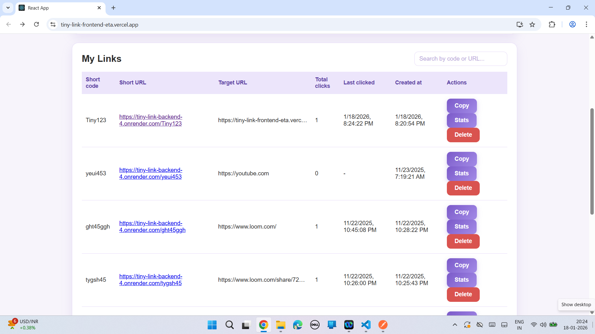
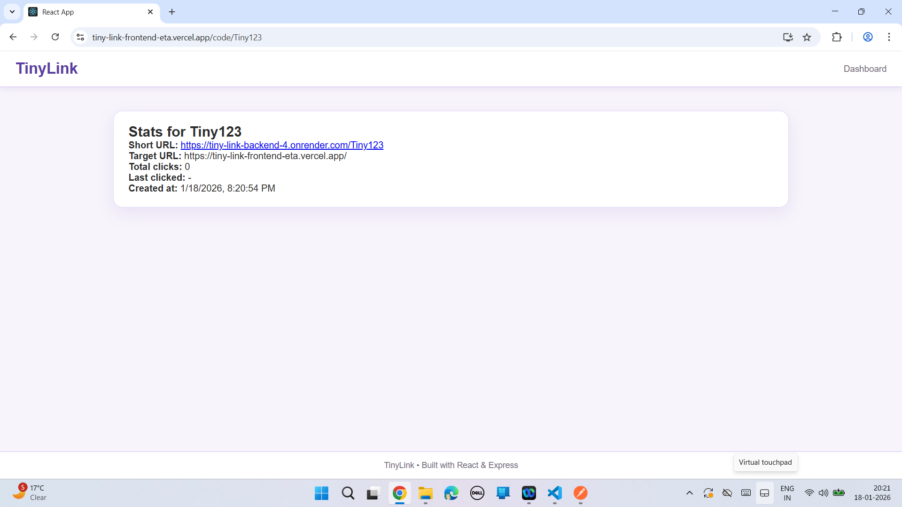
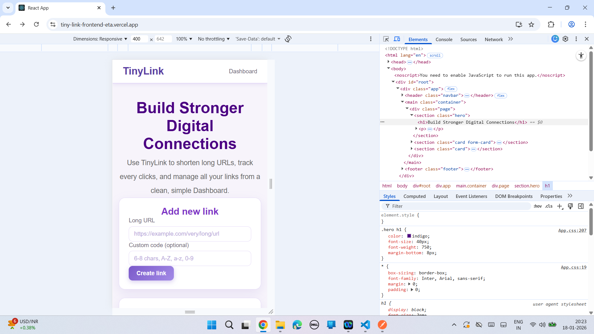

Tiny Link is the frontend of a full-stack URL shortener application that allows users to generate short links and track their usage through a clean and responsive UI.

## Live Demo
https://tiny-link-frontend-eta.vercel.app/

## Tech Stack
- React.js
- JavaScript (ES6)
- HTML
- CSS

## Features
- User-friendly interface for URL shortening
- Displays generated short URLs
- Responsive design for all devices
- Integrated with backend REST APIs

## Backend Repository
https://github.com/Tannu-2001/tiny-link-backend

## Run Locally
1. Clone the repository  
2. Run npm install  
3. Run npm start  
4. Open http://localhost:3000 in the browser

## What I Learned
- React component-based architecture
- API integration using frontend
- Managing UI state and responsiveness

## Future Improvements
- Authentication UI
- Analytics dashboard UI

## Screenshots
### Tiny Home

### Tiny Dashboard

### Tiny Status

### Mobile Responsive

